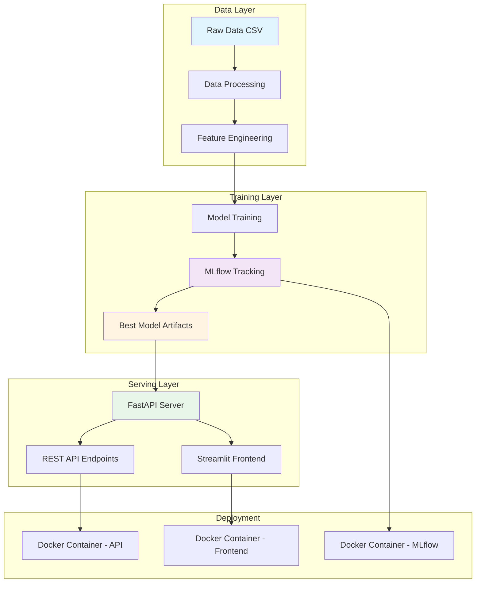
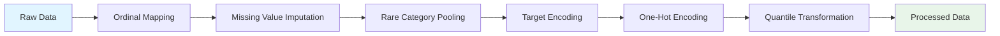
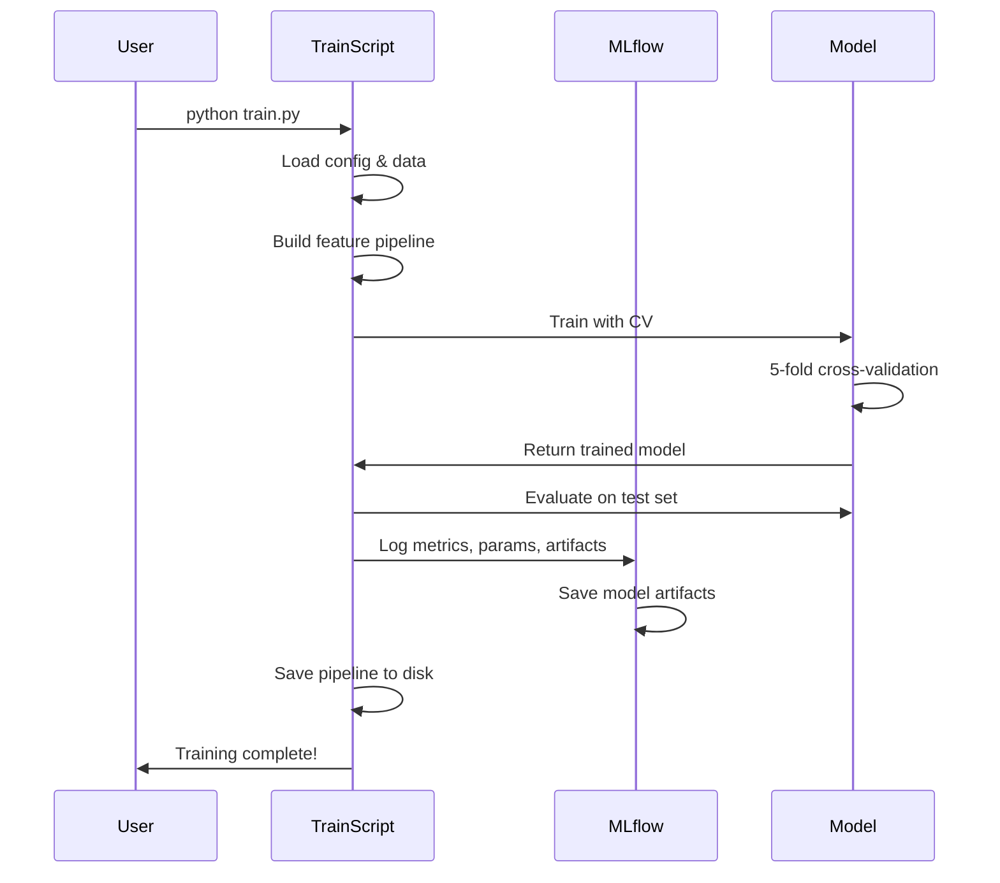

# 🏠 House Price Prediction System

A production-ready machine learning system for predicting house prices using advanced regression techniques on the Ames Housing Dataset.

[](https://www.python.org/downloads/)
[](https://github.com/astral-sh/uv)
[](https://fastapi.tiangolo.com/)
[](https://streamlit.io/)
[](https://xgboost.readthedocs.io/)
[](https://mlflow.org/)

---

## 📖 Introduction

This project implements a complete end-to-end machine learning pipeline for house price prediction, from data preprocessing and feature engineering to model training, deployment, and serving. Built with industry best practices, it features experiment tracking with MLflow, RESTful API serving with FastAPI, and an interactive web interface with Streamlit.

The system achieves **92.1% R² score** and **RMSE of $24,609** on the test set using XGBoost with carefully engineered features and optimized hyperparameters.

### 🎯 Key Features

- **🤖 Advanced ML Pipeline**: XGBoost regressor with 18+ engineered features and custom transformers
- **📊 Experiment Tracking**: Complete MLflow integration for tracking metrics, parameters, and artifacts
- **🚀 Production API**: FastAPI-based REST API with automatic documentation and validation
- **🎨 Interactive UI**: Streamlit web application for easy house price predictions
- **🐳 Docker Support**: Full containerization with Docker Compose for seamless deployment
- **🔄 Reproducible**: Version-controlled configurations and deterministic training pipeline
- **📈 High Performance**: 92.1% R² score with comprehensive cross-validation

---

## 🏗️ Overall Architecture

The system follows a modular architecture separating concerns into distinct components:



### Component Overview

| Component               | Technology           | Purpose                                  |
| ----------------------- | -------------------- | ---------------------------------------- |
| **Package Management**  | uv                   | Fast Python dependency management        |
| **Data Processing**     | Scikit-learn, Pandas | Handle missing values, encoding, scaling |
| **Feature Engineering** | Custom transformers  | Create domain-specific features          |
| **Model Training**      | XGBoost              | Train gradient boosting regressor        |
| **Experiment Tracking** | MLflow               | Track metrics, params, and artifacts     |
| **API Server**          | FastAPI              | Serve predictions via REST API           |
| **Web Interface**       | Streamlit            | Interactive prediction interface         |
| **Orchestration**       | Docker Compose       | Multi-container deployment               |

---

## � Installation

### Prerequisites

- **Python 3.12+**: Required for running the application
- **uv**: Fast Python package installer and resolver ([installation guide](https://github.com/astral-sh/uv))
- **Docker & Docker Compose**: For containerized deployment (optional)
- **2GB+ RAM**: Recommended for model training and inference

### Installing uv

If you haven't installed `uv` yet:

**On macOS and Linux:**

```bash
curl -LsSf https://astral.sh/uv/install.sh | sh
```

**On Windows:**

```powershell
powershell -c "irm https://astral.sh/uv/install.ps1 | iex"
```

**Using pip:**

```bash
pip install uv
```

### Project Setup

**Clone the repository:**

```bash
git clone <repository-url>
cd house-price-prediction
```

**Install dependencies using uv:**

```bash
# Install all dependencies from pyproject.toml
uv pip install -e .

# Or sync with lock file (if available)
uv sync
```

**Verify installation:**

```bash
uv run python --version
uv run python -c "import xgboost, fastapi, streamlit; print('✓ Dependencies installed successfully')"
```

---

## 🚀 Quick Start

### Option A: Docker Compose (Recommended)

The fastest way to get everything running:

```bash
# 1. Train the model (if not already trained)
uv run python train.py

# 2. Start all services
cd deployments/api
docker compose up -d --build

# 3. Access services
# API: http://localhost:8000
# API Docs: http://localhost:8000/docs
# Frontend: http://localhost:8501
# MLflow: http://localhost:5555
```

### Option B: Local Development with uv

For development and experimentation:

```bash
# 1. Install dependencies (if not already done)
uv pip install -e .

# 2. Train the model
uv run python train.py

# 3. Start MLflow tracking server (optional)
docker compose -f deployments/mlflow/docker-compose.yaml up -d

# 4. Start API server (in one terminal)
uv run python src/api/run_api.py

# 5. Start Streamlit frontend (in another terminal)
uv run streamlit run src/frontend/app.py
```

---

## 📁 Project Structure

```
house-price-prediction/
├── data/
│   └── raw/                                # Raw dataset
│       └── train-house-prices-advanced-regression-techniques.csv
├── src/
│   ├── api/                                # FastAPI application
│   │   ├── inference.py                    # Core inference logic
│   │   ├── main.py                        # FastAPI app definition
│   │   ├── models.py                      # Pydantic models
│   │   └── run_api.py                     # Server startup script
│   ├── features/                          # Feature engineering
│   │   └── data_featuring.py              # Domain-specific features
│   ├── frontend/                          # Streamlit web app
│   │   └── app.py                         # Web interface
│   ├── processing/                        # Data preprocessing
│   │   ├── data_processing.py             # Preprocessing pipeline
│   │   └── transforms.py                  # Custom transformers
│   ├── training/                          # Model training
│   │   ├── pipeline.py                    # Training pipeline
│   │   └── train_model.py                 # Training orchestration
│   ├── config/
│   │   └── best_model_config.json         # Best model configuration
│   └── models/                            # Trained model artifacts
│       ├── best_pipeline.joblib           # Complete ML pipeline
│       └── feature_pipeline.joblib        # Feature engineering pipeline
├── deployments/
│   ├── api/                               # API deployment configs
│   │   ├── docker-compose.yaml            # Multi-service orchestration
│   │   └── Dockerfile                     # API container image
│   └── mlflow/                            # MLflow deployment
│       └── docker-compose.yaml            # MLflow tracking server
├── notebooks/                             # Jupyter notebooks
│   └── House_Price_Prediction_Advanced_Regression_Techniques.ipynb
├── train.py                               # Main training script
├── pyproject.toml                         # Project dependencies
└── README.md                              # This file
```

---

## 📊 Model Performance

### Metrics

The XGBoost model achieves excellent performance on the Ames Housing dataset:

| Metric       | Cross-Validation | Test Set |
| ------------ | ---------------- | -------- |
| **RMSE**     | $25,259 ± $3,480 | $24,609  |
| **R² Score** | 0.892 ± 0.023    | 0.921    |

### Training Details

- **Dataset**: Ames Housing (1,460 samples, 80+ features)
- **Algorithm**: XGBoost Regressor with histogram-based tree method
- **Validation**: 5-fold stratified cross-validation
- **Train/Test Split**: 80/20
- **Feature Count**: 18 engineered + 80 original features

### Model Configuration

Key hyperparameters (from [best_model_config.json](src/config/best_model_config.json)):

```json
{
  "learning_rate": 0.012,
  "max_depth": 3,
  "min_child_weight": 1.82,
  "subsample": 0.7,
  "colsample_bytree": 0.68,
  "reg_lambda": 0.62,
  "reg_alpha": 0.44,
  "gamma": 0.2,
  "n_estimators": 4000
}
```

---

## 🔧 ML Pipeline Details

### 1. Data Processing Pipeline



**Custom Transformers:**

- `OrdinalMapper`: Maps categorical variables to ordinal values
- `MissingnessIndicator`: Creates binary indicators for missing values
- `RarePooler`: Consolidates rare categories into 'Other'
- `TargetEncoderTransformer`: Target encoding with smoothing factor
- `FiniteCleaner`: Converts infinite values to NaN
- `DropAllNaNColumns`: Removes columns with all missing values

**Preprocessing Steps:**

- Ordinal encoding for 20+ ordinal features (quality, condition ratings)
- Missing value imputation (categorical: most frequent, numerical: median)
- One-hot encoding for nominal categorical features
- Quantile transformation for numerical features (robust to outliers)

### 2. Feature Engineering

18 domain-specific features created:

| Feature Category         | Features                                         | Description                      |
| ------------------------ | ------------------------------------------------ | -------------------------------- |
| **Area Features**        | `TotalSF`, `TotalPorchSF`                        | Combined square footages         |
| **Age Features**         | `HouseAge`, `RemodAge`, `GarageAge`              | Years since construction/remodel |
| **Binary Features**      | `IsRemodeled`, `Has2ndFlr`                       | Boolean indicators               |
| **Ratio Features**       | `BathPerBedroom`, `RoomsPerArea`, `LotAreaRatio` | Normalized metrics               |
| **Seasonal Features**    | `MoSold_sin`, `MoSold_cos`                       | Cyclical month encoding          |
| **Interaction Features** | `Neighborhood_BldgType`, `IQ_OQ_GrLiv`           | Feature crosses                  |
| **Transformations**      | `Ln_TotalSF`, `LotArea_clip`                     | Log and winsorization            |

### 3. Model Training Workflow



---

## 🎯 Usage Examples

### API Usage

#### Single Prediction

```bash
curl -X POST "http://localhost:8000/predict" \
  -H "Content-Type: application/json" \
  -d '{
    "OverallQual": 7,
    "GrLivArea": 1710,
    "YearBuilt": 2003,
    "GarageCars": 2,
    "TotalBsmtSF": 856,
    "FullBath": 2
  }'
```

**Response:**

```json
{
  "predicted_price": 208500.0,
  "confidence_interval": {
    "lower": 190000.0,
    "upper": 227000.0
  }
}
```

#### Batch Prediction

```python
import requests

houses = [
    {"OverallQual": 7, "GrLivArea": 1710, "YearBuilt": 2003},
    {"OverallQual": 5, "GrLivArea": 1200, "YearBuilt": 1985}
]

response = requests.post(
    "http://localhost:8000/predict/batch",
    json={"houses": houses}
)

print(response.json())
# {"predictions": [208500.0, 145000.0]}
```

### Programmatic Usage

```python
import joblib
import pandas as pd

# Load trained pipeline
pipeline = joblib.load('src/models/best_pipeline.joblib')

# Prepare data
new_houses = pd.DataFrame([{
    "OverallQual": 7,
    "GrLivArea": 1710,
    "YearBuilt": 2003,
    "GarageCars": 2
}])

# Make prediction
predicted_prices = pipeline.predict(new_houses)
print(f"Predicted price: ${predicted_prices[0]:,.2f}")
```

### CLI Inference

```bash
uv run python src/api/inference.py data/raw/test_data.csv --output predictions.csv
```

---

## 🛠️ Development

### Running Tests

```bash
uv run pytest tests/
```

### Code Formatting

```bash
uv run black src/
```

### Training with Custom Config

```python
from src.training.train_model import train_model

train_model(
    data_path="data/raw/train-house-prices-advanced-regression-techniques.csv",
    config_path="path/to/custom_config.json",
    output_dir="outputs/",
    mlflow_experiment="My_Experiment"
)
```

---

## 🗺️ Roadmap

### ✅ Completed

- [x] End-to-end ML pipeline with preprocessing and feature engineering
- [x] XGBoost model with hyperparameter tuning
- [x] MLflow integration for experiment tracking
- [x] FastAPI REST API with automatic documentation
- [x] Streamlit web interface
- [x] Docker containerization and orchestration
- [x] Batch prediction support

### 🚧 In Progress

- [ ] Model versioning and A/B testing
- [ ] Production monitoring and alerting
- [ ] Automated model retraining pipeline

### 🔮 Future Plans

- [ ] Add support for CatBoost and LightGBM models
- [ ] Implement feature importance dashboard
- [ ] Add data drift detection
- [ ] CI/CD pipeline with automated testing
- [ ] Kubernetes deployment manifests
- [ ] Model interpretability with SHAP values
- [ ] Real-time prediction streaming
- [ ] Multi-model ensemble predictions

---

## 🤝 Contributing

Contributions are welcome! Please follow these guidelines:

### Getting Started

1. Fork the repository
2. Create a feature branch: `git checkout -b feature/amazing-feature`
3. Make your changes and commit: `git commit -m 'Add amazing feature'`
4. Push to the branch: `git push origin feature/amazing-feature`
5. Open a Pull Request

### Code Standards

- Follow PEP 8 style guidelines
- Add docstrings to all functions and classes
- Write unit tests for new features
- Update documentation as needed
- Run `uv run black` for code formatting before committing

### Reporting Issues

Please use GitHub Issues to report bugs or request features. Include:

- Clear description of the issue/feature
- Steps to reproduce (for bugs)
- Expected vs actual behavior
- Environment details (OS, Python version, etc.)

---

## 📄 License

This project is licensed under the MIT License

---

## 🙏 Acknowledgments

- **Dataset**: [Ames Housing Dataset](http://jse.amstat.org/v19n3/decock.pdf) by Dean De Cock
- **Kaggle Competition**: [House Prices - Advanced Regression Techniques](https://www.kaggle.com/c/house-prices-advanced-regression-techniques)
- **Educational Project**: AIO2025 Project 5.1

---

## 📞 Contact & Support

- **Issues**: [GitHub Issues](https://github.com/yourusername/house-price-prediction/issues)
- **Discussions**: [GitHub Discussions](https://github.com/yourusername/house-price-prediction/discussions)

---

## 📚 Additional Resources

- [FastAPI Documentation](https://fastapi.tiangolo.com/)
- [Streamlit Documentation](https://docs.streamlit.io/)
- [XGBoost Documentation](https://xgboost.readthedocs.io/)
- [MLflow Documentation](https://www.mlflow.org/docs/latest/index.html)
- [Scikit-learn Documentation](https://scikit-learn.org/stable/)

---

<div align="center">

**⭐ If you find this project helpful, please consider giving it a star! ⭐**

Made with ❤️ by the community

</div>
